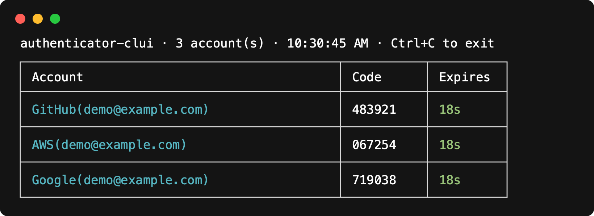

# OTPeer

[](https://www.npmjs.com/package/authenticator-clui)
[](LICENSE)


**Website:** [https://otpeer.com](https://otpeer.com)

**OTPeer** is an open source two-factor authenticator you fully own: your
codes live in an encrypted local vault and sync **peer-to-peer between your
own devices** — no cloud, no account, no telemetry. Import once from
Google/Microsoft/Facebook Authenticator (or Aegis, 2FAS, andOTP) and read
live codes from your terminal today; desktop and mobile apps are on the
[roadmap](#roadmap).

The CLI ships on npm as
[`authenticator-clui`](https://www.npmjs.com/package/authenticator-clui)
(its original name, kept for its install base); the product family, and the
future desktop/mobile apps ("OTPeer Authenticator" in the stores), carry
the OTPeer brand — see the
[branding decision](docs/plan/stage-c2-rebranding.md).

**👉 End users:** download Desktop or install the CLI from
[otpeer.com](https://otpeer.com). CLI details also live on the
[package README](packages/cli/README.md) and
[npm](https://www.npmjs.com/package/authenticator-clui). This page is about
the project as a whole: architecture, building from source, and contributing.



## Table of contents

- [Vision](#vision)
- [Repository structure](#repository-structure)
- [Architecture](#architecture)
- [Building from source](#building-from-source)
- [Desktop releases](#desktop-releases)
- [Running the CLI from a checkout](#running-the-cli-from-a-checkout)
- [Testing](#testing)
- [Publishing](#publishing)
- [Roadmap](#roadmap)
- [Contributing](#contributing)
- [Security](#security)
- [License](#license)

## Vision

Today this repo ships one product: the `authenticator-clui` npm package.
The goal is one authenticator, three surfaces, all sharing the same vault
logic:

| Surface | Status | Distribution |
|---|---|---|
| **CLI** (Node.js) | ✅ published | [npm](https://www.npmjs.com/package/authenticator-clui) |
| **Desktop** "OTPeer Authenticator" (Electron, Mac/Ubuntu/Windows) | ✅ app ready | [otpeer.com](https://otpeer.com) ([GitHub Releases](https://github.com/sthnaqvi/otpeer-authenticator/releases) for artifacts; Homebrew/Flathub/winget later) |
| **Mobile** "OTPeer Authenticator" (React Native, iOS/Android) | 🔜 planned | App Store / Play Store / F-Droid |

Devices will sync **peer-to-peer over the local network, QR-paired — no
backend server, no account, and no permissions beyond the camera and iOS's
local-network prompt**. Each device keeps its own encrypted vault; sync is
an explicit, local, device-to-device merge.

## Repository structure

This is an npm-workspaces monorepo. The root is private and never published
— only individual packages ship to users, each through its own channel.

```
otpeer-authenticator/
├── package.json            workspace root (private — publishes nothing)
├── packages/
│   ├── core/                packages/core — shared engine (TypeScript)
│   │   └── src/
│   │       ├── accounts.ts           vault load/save orchestration
│   │       ├── totp.ts                TOTP code generation, window timing
│   │       ├── edbase32.ts             RFC 3548 base32 encoding
│   │       ├── importers/              Google Authenticator export decoding
│   │       ├── adapters/               StorageAdapter / CryptoProvider interfaces
│   │       └── node/                    Node.js implementations of the adapters
│   ├── cli/                 authenticator-clui — the published npm package
│   │   ├── bin.js                    command-line entry (`authenticator`, `auth`)
│   │   ├── core.js                    wires the vendored core to CLI storage paths
│   │   ├── src/                       terminal-only code (password prompt, table render)
│   │   └── vendor/core/               build-generated copy of core (gitignored)
│   └── desktop/             "OTPeer Authenticator" — Electron + React app
│       ├── electron/                 main (fixed window + tray), preload, vault-service
│       ├── build/                     OTPeer app / tray icons (icns, ico, png)
│       ├── src/renderer/              React UI (hamburger IA, accounts, sync)
│       └── vendor/core/               build-generated copy of core (gitignored)
├── website/                 otpeer.com landing page (Vite → GitHub Pages)
├── docs/plan/               in-depth design docs, one per roadmap stage
└── readme_assets/           images used by the READMEs
```
## Architecture

The design rule that everything else follows from: **`packages/core`
contains all logic that must behave identically on every platform, and it
never touches a platform API directly.** It talks to the outside world only
through two injected interfaces:

```ts
interface StorageAdapter {          // where the vault blob lives
  read(): Promise<string | null>;
  write(data: string): Promise<void>;
  delete(): Promise<void>;
  exists(): Promise<boolean>;
}

interface CryptoProvider {          // how the vault is encrypted
  encrypt(plaintext: string, password: string): string;
  decrypt(ciphertext: string, password: string): string;
}
```

Each client supplies its own implementations:

| | Storage | Crypto |
|---|---|---|
| CLI / Electron | `fs` → `~/.authenticator-clui/` | Node built-in `crypto` |
| React Native (planned) | `react-native-mmkv` | `react-native-quick-crypto` |

This is why React Native support is feasible without rewriting the engine:
RN can't run Node's `fs`/`crypto`, but it can implement these two
interfaces.

**Why core is vendored, not a published dependency:** `packages/core` is
`private: true` and exists only inside this repo (its npm workspace name is
still required by npm, but clients load a vendored copy, not that import path).
The CLI's build step copies core's compiled output into
`packages/cli/vendor/core`, so the published npm tarball is fully
self-contained. This keeps core's API free to change rapidly during early
development. Once it stabilizes, it may be published as its own package.

## Building from source

Requirements: Node.js ≥ 14, npm ≥ 7 (for workspaces support).

```bash
git clone https://github.com/sthnaqvi/otpeer-authenticator.git
cd otpeer-authenticator
npm install        # installs all workspace deps, links core into cli
npm run build      # compiles core (tsc) + vendors it into packages/cli
```

`npm run build` at the root does two things, in order:

1. `packages/core`: TypeScript → `packages/core/dist/`
2. `packages/cli`: copies `core/dist` → `packages/cli/vendor/core`

Both output directories are gitignored; they're always regenerated.

## Desktop releases

End users should download **OTPeer Authenticator** from
[otpeer.com](https://otpeer.com) (OS-aware links to the latest build).

Installers are published on
[GitHub Releases](https://github.com/sthnaqvi/otpeer-authenticator/releases)
(tags named `desktop-v*`, e.g. `desktop-v0.1.0`) — that is the artifact
source of truth the website points at.

| Platform | Artifact |
|---|---|
| macOS | `.dmg` (`arm64` = Apple Silicon, `x64` = Intel) |
| Windows | NSIS `.exe` |
| Linux | `.AppImage` and `.deb` |

### macOS install (Phase 1 — no Apple Developer signing yet)

| What you see | Why |
|---|---|
| **“… is damaged and can’t be opened”** | App has no **Developer ID** signature. On recent macOS, Chrome/Safari downloads of unsigned apps get this dialog (not the older “unidentified developer” one). |
| **“Apple could not verify…” / unidentified developer** | Requires a paid [Apple Developer Program](https://developer.apple.com/programs/) **Developer ID Application** certificate (~$99/year). |
| Opens with no warning | Requires Developer ID **plus Apple notarization**. |

Unsigned builds cannot produce the “unidentified developer” dialog for browser downloads — Apple closed that path. Until notarization is wired, clear quarantine once after install:

```bash
xattr -cr "/Applications/OTPeer Authenticator.app"
open "/Applications/OTPeer Authenticator.app"
```

When you have an Apple Developer account, we can add CI signing + notarization so Mac users get a normal install.

**Maintainers — cut a release:**

1. Merge desktop work to `master`.
2. Confirm `packages/desktop/package.json` `version` (e.g. `0.1.0`).
3. Tag and push: `git tag desktop-v0.1.0 && git push origin desktop-v0.1.0`
4. Wait for the **Desktop release** workflow; assets appear on the Releases page.

Local Mac-only packaging: `cd packages/desktop && npm run dist`.

## Running the CLI from a checkout

```bash
cd packages/cli
node bin.js --help
node bin.js --import "otpauth-migration://offline?data=..."
node bin.js --run
```

The vault is written to `~/.authenticator-clui/accounts.json` — same
location as an installed copy, so be aware they share state.

## Testing

Core has a Jest test suite covering encryption (GCM round-trip, tamper
detection, legacy CBC decrypt), vault format migrations, storage-path
migration, TOTP window alignment, base32 encoding, and import parsing.

```bash
npm test           # runs core's test suite from the repo root
```

## Publishing

Only `packages/cli` is published, and only from that directory:

```bash
cd packages/cli
npm publish
```

`prepublishOnly` automatically runs the full root build first, so a publish
can never ship a stale or missing `vendor/core`. Publishing from the repo
root is blocked by design (`private: true`).

Release checklist:

1. Bump the version: `cd packages/cli && npm version minor` (or
   `patch`/`major`). Note: npm does **not** auto-commit or tag in a monorepo
   subfolder — that's step 4, and why it's listed separately.
2. `npm install` at the repo root to resync `package-lock.json`, and update
   the [package README](packages/cli/README.md) if user-facing behavior
   changed; commit.
3. `cd packages/cli && npm publish`
4. Tag the release: `git tag v<version> && git push --tags`

## Roadmap

Development is staged; each stage has an in-depth design doc in
[`docs/plan/`](docs/plan/):

| Stage | Scope | Doc |
|---|---|---|
| A1 ✅ | Extract shared core, monorepo restructure, publish hardening | [doc](docs/plan/stage-a1-extract-core.md) |
| A2 ✅ | Vault format versioning, AES-GCM upgrade, migrations, test suite | [doc](docs/plan/stage-a2-vault-migration.md) |
| B ✅ | CLI: single-account CRUD, code/copy/qr/export, otplib removal | [doc](docs/plan/stage-b-cli-account-management.md) |
| B2 ✅ | Full OTP compatibility (8-digit/60s/SHA-256/HOTP/Steam), Aegis/2FAS/andOTP imports, paper backup | [doc](docs/plan/stage-b2-otp-compat-and-imports.md) |
| C ✅ | P2P sync v1: QR-paired local sync, minimal permissions, LWW merge | [doc](docs/plan/stage-c-sync-protocol.md) |
| C2 ✅ | Rebranding: OTPeer product family, ASO/store naming, marketing plan | [doc](docs/plan/stage-c2-rebranding.md) |
| D ✅ | Desktop app "OTPeer Authenticator" (Electron, Mac/Ubuntu/Windows) — [deployment channels](docs/plan/stage-d-deployment-channels.md) | [doc](docs/plan/stage-d-desktop-electron.md) |
| D2 | Website at [otpeer.com](https://otpeer.com) — Desktop downloads, CLI install, marketing | [doc](docs/plan/stage-d2-website.md) |
| E | Mobile app "OTPeer Authenticator" (React Native, iOS/Android) | [doc](docs/plan/stage-e-mobile-react-native.md) |
| F | CI, packaging, store submissions | [doc](docs/plan/stage-f-distribution.md) |
| G | Browser extension (desktop-app native messaging) | [doc](docs/plan/stage-g-browser-extension.md) |

## Contributing

Contributions are welcome — bug reports, fixes, and stage work alike.

**Where things go:**

- Platform-independent logic (vault, crypto orchestration, TOTP, import
  parsing, future sync) → `packages/core`, in TypeScript, behind the
  adapter interfaces. Core must never `require` `fs`, `crypto`, or any
  platform module outside `src/node/`.
- Terminal-specific code (argument parsing, prompts, table rendering) →
  `packages/cli`.
- New platform (e.g. a new client) → new `packages/<name>` workspace that
  consumes core; don't fork core logic into a client.

**Workflow:**

1. Fork and branch from `master`
2. `npm install && npm run build`, make your change
3. Verify the CLI flows still work (`--import`, `--run`, `--delete`,
   `--encrypt` round-trip) — behavior changes to existing flags need a
   strong reason
4. Open a PR describing what changed and why; link the roadmap stage if
   your change is part of one

**Ground rules:**

- Existing users' vaults are sacred: any change to the storage location or
  file format must ship with an automatic migration (see
  [stage-a2 doc](docs/plan/stage-a2-vault-migration.md) for the pattern).
- No network calls anywhere in the codebase until Stage C, and then only
  the explicit local sync path. This project's core promise is that
  secrets stay on-device.
- Keep the published tarball auditable: `packages/cli/package.json` uses a
  `files` whitelist; if you add a runtime file, add it there deliberately.

**Reporting issues:**
[github.com/sthnaqvi/otpeer-authenticator/issues](https://github.com/sthnaqvi/otpeer-authenticator/issues)

## Security

This project handles 2FA secrets, so the bar is deliberately conservative:

- Vault encryption: AES-256-GCM authenticated encryption with random IV +
  salt per encryption and scrypt key derivation — wrong passwords and
  tampered/corrupted vault files fail loudly at the auth-tag check. Vaults
  written by older versions (AES-256-CBC) are transparently re-encrypted to
  GCM on first use.
- No network, no telemetry, no analytics
- Found a vulnerability? Please open an issue asking for a private contact
  channel rather than posting exploit details publicly.

## License

[MIT](LICENSE) © Sayed Tauseef Naqvi
